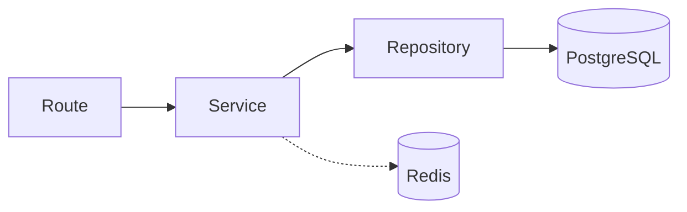

# 🧺 Campus Laundry O2O System

[](https://fastapi.tiangolo.com/)
[](https://www.postgresql.org/)
[](https://www.sqlalchemy.org/)
[](https://redis.io/)
[](https://www.python.org/)

A state-of-the-art, high-performance backend solution designed to bridge the gap between students and laundry service providers. Built with a focus on **scalability**, **linear code clarity**, and **data integrity**.

---

## 🌟 High-Level Features

### 🏢 Vendor Ecosystem
- **Dynamic Catalog Management**: Real-time category and service item updates with Redis caching.
- **Intelligent Vendor Dashboard**: Capacity tracking, bulk status updates, and daily/monthly analytics snapshots.
- **Operational Status**: Real-time "Open/Closed" toggle for vendors with immediate student-side visibility.

### 💳 Financial & Security
- **Transactional Ledger**: Immutable double-entry records for all financial movements.
- **Credit Tab System**: Managed credit limits for students with automated debt reminders.
- **Idempotency Engine**: Critical payment and transaction safety via a built-in idempotency layer.
- **Advanced Auth**: Role-based access control (RBAC) for Students, Vendors, and Admins via Argon2 and JWT.

### 📦 Operational Excellence
- **Smart Booking System**: Pickup/delivery scheduling with status logging.
- **Waitlist Management**: Automated student queuing for high-demand services.
- **Multi-Channel Notifications**: Built-in support for in-app and external communication.

---

## 🏗️ Architectural Excellence

The project follows a strict **linear architecture** designed for long-term maintainability and zero-boilerplate overhead.



### Core Principles:
- **Zero-Fragment Services**: Public service methods are linear and procedural, avoiding "private method hopping."
- **Strict Layer Separation**: Business logic stays in Services; Persistence stays in Repositories.
- **Type Safety**: Fully typed SQLAlchemy 2.0 `Mapped` models and Pydantic V2 schemas.

---

## 📂 Project Anatomy

```text
app/
├── apps/               # Modular features (Order Management, Ledger, etc.)
│   └── [feature]/      # Each feature contains models, schemas, routes, and services
├── core/               # Global engine (Database, Redis, Security, Settings)
├── shared/             # Shared logic (Auth dependencies, centralized routing)
└── main.py             # Application entry point
tests/                  # Transactional PostgreSQL integration tests
alembic/                # Database version control
```

---

## 🛠️ Tech Stack & Dependencies

| Category | Technology |
| :--- | :--- |
| **Framework** | FastAPI (Asynchronous) |
| **ORM** | SQLAlchemy 2.0 (Typed Declarative) |
| **Database** | PostgreSQL |
| **Caching** | Redis (with `redis-py`) |
| **Migrations** | Alembic |
| **Validation** | Pydantic V2 |
| **Security** | Argon2-CFFI, Python-Jose (JWT) |
| **Monitoring** | Loguru, SlowAPI (Rate Limiting) |

---

## 🏁 Getting Started

### 1. Prerequisites
- Python 3.12+
- PostgreSQL
- Redis

### 2. Setup Environment
```bash
# Clone the repository
git clone [your-repo-url]
cd LAUNDRY-MANAGEMENT-SYSTEM

# Initialize Virtual Environment
python3 -m venv venv
source venv/bin/activate

# Install Dependencies
pip install -r requirements.txt
```

### 3. Configuration
Create a `.env` file from the example:
```bash
cp .env.example .env
# Edit .env with your local credentials
```

### 4. Database Initialization
```bash
alembic upgrade head
```

### 5. Launch
```bash
python -m uvicorn app.main:app --reload
```

---

## 🧪 Testing Infrastructure

The system includes a production-grade testing suite that uses a dedicated PostgreSQL test database and transactional rollbacks.

```bash
# Run all tests
pytest -v
```

> [!TIP]
> Refer to [commands.md](commands.md) for a comprehensive list of development and infrastructure commands.

---

## 🛡️ API Documentation

Once running, access the interactive documentation at:
- **Swagger UI**: `http://localhost:8000/docs`
- **ReDoc**: `http://localhost:8000/redoc`

---

Developed with ❤️ for the Campus Laundry Ecosystem.
